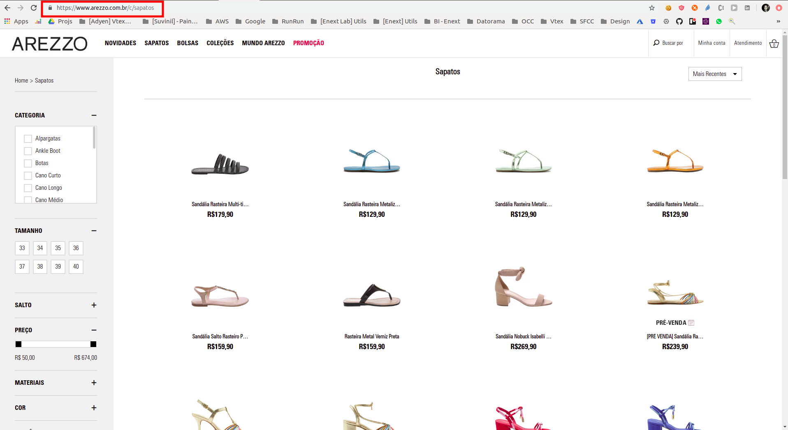
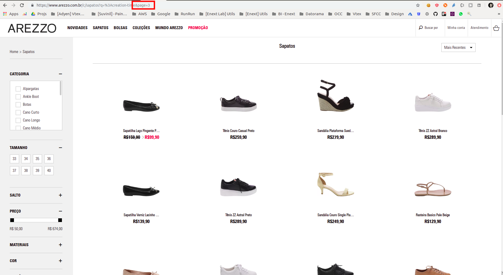
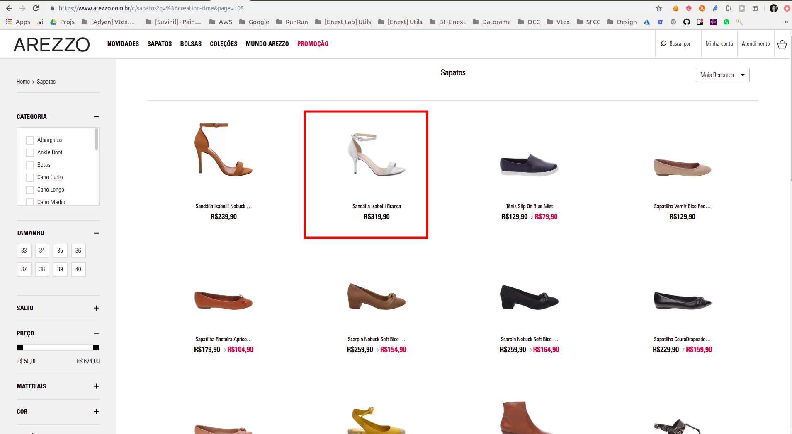
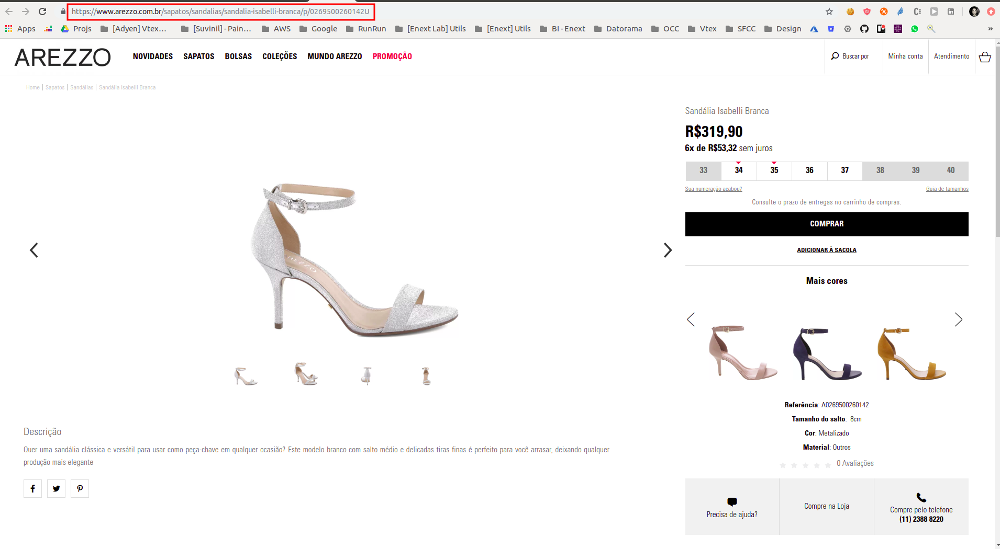

# Teste Estagiário Fullstack Enext Labs - Products Webcrawler V1

Seja bem vindo ao teste do Enext Labs!

Neste teste você deverá criar um [webcrawler](https://linux.ime.usp.br/~cef/mac499-06/monografias/andre/WebCrawler.html), buscar a informaçoes de produtos de um dos sites parceiros da Enext ([https://www.arezzo.com.br](https://www.arezzo.com.br)) na seção de [sapatos](https://www.arezzo.com.br/c/sapatos) e utilizar as urls dos produtos para tentar decriptar uma imagem [encodada em base64](https://pt.wikipedia.org/wiki/Base64) e encriptada com [AES 256 ECB](https://proprivacy.com/guides/aes-encryption). O objetivo final do teste é conseguir decriptar a imagem em questão e enviar para nós um printscreen da imagem.

Para obter a imagem original, que será fornecida para você encodada e encriptada, você poderá utilizar tanto ferramentas online como libraries na linguagem que você escolheu para desenvolver. Seguem abaixo algumas sugestões, você poderá usar outra lib ou ferramenta sem problema algum:

* Ferramenta online para fazer o encoding e decoding de imagens em base 64: 
    * [https://base64.guru/converter/decode](https://base64.guru/converter/decode)
    * [https://base64.guru/converter/encode](https://base64.guru/converter/encode)
* Lib em nodejs para fazer o encoding e decoding de imagens em base 64: [https://www.npmjs.com/package/base64-img](https://www.npmjs.com/package/base64-img)
* Exemplo de código em nodejs para fazer o encoding e decoding de imagens em base 64: [https://gist.github.com/sid24rane/bdf557cf9f835181a994439da0b5b82a](https://gist.github.com/sid24rane/bdf557cf9f835181a994439da0b5b82a)
* Exemplo de código em python para fazer o encoding e decoding de uma imagem em base 64: [https://www.programcreek.com/2013/09/convert-image-to-string-in-python/](https://www.programcreek.com/2013/09/convert-image-to-string-in-python/)
* Ferramenta online para encriptar e decriptar com AES 256: [https://www.devglan.com/online-tools/aes-encryption-decryption](https://www.devglan.com/online-tools/aes-encryption-decryption)
* Lib em nodejs para encriptar e decriptar com AES 256: [https://nodejs.org/api/crypto.html](https://nodejs.org/api/crypto.html)
* Lib em python para encriptar e decriptar com AES 256: [https://www.quickprogrammingtips.com/python/aes-256-encryption-and-decryption-in-python.html](https://www.quickprogrammingtips.com/python/aes-256-encryption-and-decryption-in-python.html)

Nas linhas abaixo iremos detalhar cada uma das etapas do desafio.

# Task 1 [OBRIGATÓRIA] - Construção do Webcrawler

Você deverá criar um webcrawler em qualquer linguagem (python, nodejs, java, c# etc) para obter as urls de todos os sapatos de arezzo:

Nesse vídeo temos uma demonstração de como contruir um webcrawler em nodejs: [https://www.youtube.com/watch?v=2B6MpQvsQp0](https://www.youtube.com/watch?v=2B6MpQvsQp0)

Essa lib é interessante para criar um webcrawler em nodejs: [https://www.npmjs.com/package/crawler](https://www.npmjs.com/package/crawler)

**Seção de sapatos**: [https://www.arezzo.com.br/c/sapatos](https://www.arezzo.com.br/c/sapatos)



**Iterando por todas as páginas**: Ex.: [https://www.arezzo.com.br/c/sapatos?q=%3Acreation-time&page=3](https://www.arezzo.com.br/c/sapatos?q=%3Acreation-time&page=3)



**Obtendo a url de um produto**: Ex.: [https://www.arezzo.com.br/sapatos/sandalias/sandalia-isabelli-branca/p/0269500260142U](https://www.arezzo.com.br/sapatos/sandalias/sandalia-isabelli-branca/p/0269500260142U)





Como você pode ver pela imagem acima, a url do produto em questão é "https://www.arezzo.com.br/sapatos/sandalias/sandalia-isabelli-branca/p/0269500260142U". O seu webcrawler desenvolvido deverá obter a url de todos os produtos que estão na categoria sapato.

# Task 2 [OPCIONAL] - Validar se o seu código para decriptar e decodar a imagem está funcionando (você poderá utilizar o exemplo fornecido)

## SAMPLE_IMAGE_ENCODED_AND_ENCRYPTED

No arquivo anexo [encoded_and_encrypted_images/SAMPLE_IMAGE_ENCODED_AND_ENCRYPTED.txt](encoded_and_encrypted_images/SAMPLE_IMAGE_ENCODED_AND_ENCRYPTED.txt), encontramos um exemplo de uma imagem PNG encodada em base 64 e encritada com AES 256 no formato hexadecimal semelhante a imagem principal do desafio.

A imagem em questão foi encriptada com a seguinte url: "https://www.arezzo.com.br/sapatos/rasteiras/sandalia-rasteira-metalizada-tiras-azul/p/0327400120111U", mais especificamente com o [hash MD5](https://emn178.github.io/online-tools/md5.html) dessa string:

KEY = HASH_MD5("https://www.arezzo.com.br/sapatos/rasteiras/sandalia-rasteira-metalizada-tiras-azul/p/0327400120111U") = "c7c10addbb795f17c0dd813b6b740b54"

Para obter a imagem a original a partir da string fornecida e da url chave, podemos executar o seguinte script em nodejs:

```javascript
// Import das dependências
const md5 = require('md5');
const crypto = require('crypto');
const fs = require('fs');
const path = require('path');

// Obtendo a imagem string que representa a imagem fornecida, encodada em base 64 e encriptada com AES 256
const encriypedAndEncodedImage = fs.readFileSync('../../public/encoded_and_encrypted_images/SAMPLE_IMAGE_ENCODED_AND_ENCRYPTED.txt', 'utf-8');

// Obtendo a chave que encriptou a imagem
const KEY_URL = "https://www.arezzo.com.br/sapatos/rasteiras/sandalia-rasteira-metalizada-tiras-azul/p/0327400120111U";
const KEY = md5(KEY_URL);

// Função para decriptar um texto em hexadecimal com a chave fornecida usando AES 256 ECB
function decrypt(key, text) {
    var decipher = crypto.createDecipheriv('aes-256-ecb', key.toString('binary'), '');
    decipher.setAutoPadding(false);
    var dec = decipher.update(text, 'hex', 'utf8');
    dec += decipher.final('utf8');
    return dec
}

// Função que cria um arquivo de imagem a partir da string base64 desta
function decode_base64(base64str, filename) {
    var buf = Buffer.from(base64str, 'base64');
    fs.writeFileSync(path.join(__dirname, filename), buf);
}

const encodedImage = decrypt(KEY, encriypedAndEncodedImage);
decode_base64(encodedImage, 'original_image.png');
```

Após executar o script, obteremos a seguinte imagem:


Na Task 2 você deverá verificar para a imagem de exemplo fornecida se o seu código de decrypt e decode está funcionando corretamente.

# Task 3 [OBRIGATÓRIA] - Descubra quais urls de produto são as chaves para decriptarmos as imagens

Para obter a imagem original você deverá testar para cada key candidata se imagem gerada é válida. Colocamos na imagem de teste e na imagem principal do desafio um bloco de pixels pretos (de aproximadamente 200px x 200px) na canto superior esquerdo da imagem. Você poderá usar esse padrão para identificar mais facilmente a imagem que estamos interessados. Mas também será possível gerar todas as imagens a partir das keys e verificar uma a uma qual a imagem que queremos, tal imagem conterá um texto de boas vindas ao Enext Labs com uma imagem de fundo.

Como já foi falado anteriormente, a key para descriptografar a imagem é baseada no md5 da url de um dos produtos. Como existe o risco de um dos produtos do teste ser excluído da Arezzo, fornecemos três imagens para o desafio encodadas com 3 urls dos produtos diferentes. Você só precisa encontrar uma das três urls que descriptografam uma das três imagens fornecidas.

As imagens criptografadas que você deverá descriptografar são as seguintes:

* [encoded_and_encrypted_images/MAIN_IMAGE_1_ENCODED_AND_ENCRYPTED.txt](encoded_and_encrypted_images/MAIN_IMAGE_1_ENCODED_AND_ENCRYPTED.txt)
* [encoded_and_encrypted_images/MAIN_IMAGE_2_ENCODED_AND_ENCRYPTED.txt](encoded_and_encrypted_images/MAIN_IMAGE_2_ENCODED_AND_ENCRYPTED.txt)
* [encoded_and_encrypted_images/MAIN_IMAGE_3_ENCODED_AND_ENCRYPTED.txt](encoded_and_encrypted_images/MAIN_IMAGE_3_ENCODED_AND_ENCRYPTED.txt)

# Task 4 [OBRIGATÓRIO] - Crie uma aplicação web com um formulário para testar as urls

Nessa tarefa, você deverá criar uma página em html, css e javascript puro ou com alguma framework como react, angular, bootstrap etc. Tal página deverá conter um formulário que deve:

* Conter um campo para entrada da imagem encodada e encriptada em texto;
* Conter um campo para a url chave candidata a descriptografar a imagem;
* Conter um botão para testar a chave em questão;
* Apresentar para o usuário a imagem descriptograda ou uma mensagem falando que a chave em questão não é válida.

Você pode incrementar o quanto quiser essa interface para melhorar a experiência dos usuários que irão interagir com ela.
Você pode simplificar a lógica para indicar seu uma url de produto é a key válida ou não, você deve exibir a imagem decriptada apenas quando o usuário inserir a url do produto que você descobriu na task 3.

# Observações

* Você poderá utiliza qualquer linguagem para resolver o desafio, recomendamos python, nodejs ou java;
* É extremamente recomendado a implementação de um arquivo README.md explicando com sua solução funciona, dependências, setup, tecnologias utilizadas etc;
* É extremamente recomendado a utilização de git com commits claros e concisos;
* Você deverá se cadastrar em nossa vaga no gupy ([https://enext.gupy.io/jobs/79401](https://enext.gupy.io/jobs/79401)) e enviar um .zip com todos os arquivos pertinentes. Não se esqueça de colocar o .git no .zip e também, o screenshot da imagem do desafio e também mencionar no email qual é a url de produto para decriptar uma das imagens.

# Dúvidas

Qualquer dúvida no teste em questão pode ser direcionada diretamente para 

* Marco Aurélio Prado dos Santos Vidoca
* tel: (11) 98140-5682
* email: marco.vidoca@enext.com.br
